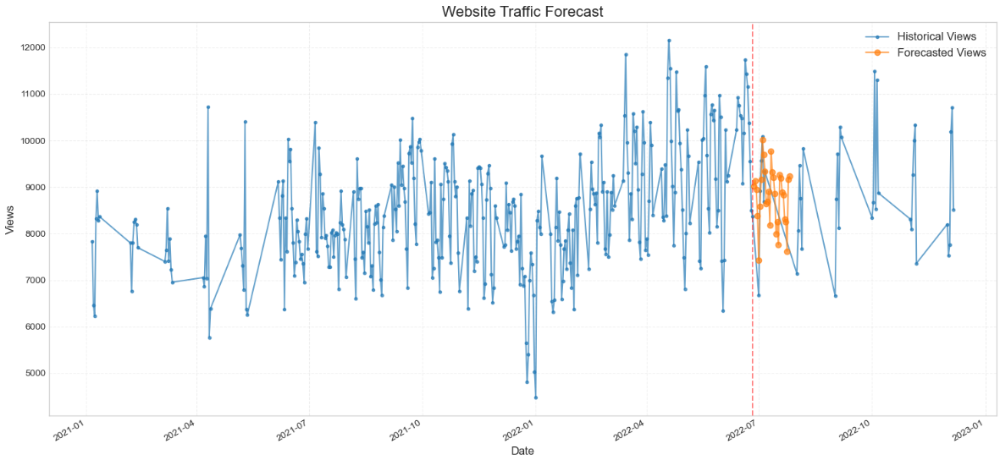

# Website Traffic Prediction



## Project Overview

This project implements a machine learning approach to forecast website traffic for "The Clever Programmer" website. Using historical traffic data, the model predicts future website visits, identifies patterns and trends, and provides insights to help with content strategy and resource planning.

## Dataset

The dataset used in this project comes from [Statso.io's forecasting website traffic case study](https://statso.io/forecasting-website-traffic-case-study/). It contains daily website traffic data for "The Clever Programmer" website, including number of views over time.

## Features

- **Comprehensive Exploratory Data Analysis (EDA)**: Visualize traffic patterns, seasonal trends, and statistical distributions
- **Advanced Feature Engineering**: Generate time-based features to capture temporal patterns
- **Multiple Modeling Approaches**: 
  - Machine Learning Models (Linear Regression, Decision Trees, Random Forest, KNN, MLP)
  - Time Series Models (ARIMA)
- **Model Evaluation and Comparison**: Compare different approaches using multiple metrics (RMSE, MAE, R²)
- **Feature Importance Analysis**: Identify which factors most influence website traffic
- **Future Traffic Forecasting**: Predict website traffic for future dates
- **Actionable Insights and Recommendations**: Detailed conclusions for content strategy and resource planning

## Project Structure

```
Website-Traffic-Prediction/
├── data-set/
│   └── Thecleverprogrammer.csv
├── images/
│   ├── img1.png
│   └── img2.png
├── models/
│   └── rf_model.pkl
├── Website_Traffic_Prediction.ipynb
├── requirements.txt
└── README.md
```

## Model Performance


Our analysis found that the Random Forest model with datetime features performed the best, achieving the lowest RMSE and MAE with the highest R² score compared to other modeling approaches.

## Installation and Setup

1. Clone the repository:
   ```bash
   git clone https://github.com/mostafaeslam/Website-Traffic-Prediction.git
   cd Website-Traffic-Prediction
   ```

3. Create a virtual environment (recommended):
   ```bash
   python -m venv venv
   source venv/bin/activate  # On Windows, use: venv\Scripts\activate
   ```

4. Install the required packages:
   ```bash
   pip install -r requirements.txt
   ```

## Usage

1. Open the Jupyter notebook:
   ```bash
   jupyter notebook Website_Traffic_Prediction.ipynb
   ```

2. Run the cells in order to:
   - Load and explore the dataset
   - Perform feature engineering
   - Train multiple prediction models
   - Evaluate and compare model performance
   - Generate traffic forecasts
   - View conclusions and recommendations

## Making Predictions with the Saved Model

```python
import joblib
import pandas as pd
import numpy as np

# Load the model and scalers
model = joblib.load('models/rf_model.pkl')
feature_scaler = joblib.load('models/feature_scaler.pkl')
target_scaler = joblib.load('models/target_scaler.pkl')

# Prepare input data with the same features used during training
# ...

# Make prediction
scaled_features = feature_scaler.transform(input_features)
scaled_prediction = model.predict(scaled_features)
prediction = target_scaler.inverse_transform(scaled_prediction.reshape(-1, 1)).ravel()
```

## Key Findings

1. **Temporal Patterns**: Significant day-of-week and seasonal patterns affect website traffic
2. **Growth Trends**: Long-term growth patterns captured in yearly trends
3. **Traffic Drivers**: The most influential factors for predicting traffic are day of week, month, and yearly trends

## Recommendations

- Publish new content on historically high-traffic days
- Scale server resources in anticipation of predicted traffic spikes
- Use forecasts to estimate future ad revenue and business growth
- Schedule maintenance during predicted low-traffic periods

## Future Improvements

- Incorporate external factors (marketing campaigns, SEO changes)
- Implement automated anomaly detection
- Create an interactive dashboard for real-time forecasting
- Expand to predict additional metrics (engagement, bounce rates)

## License

[MIT License](LICENSE)

## Contact

For questions or collaboration, please contact [mostafaeslam1220@gmail.com].
